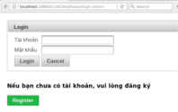
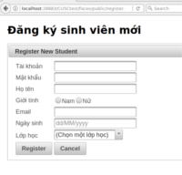
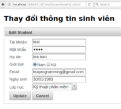

# CUSCstart
A Java JSF + PrimeFaces project for managing students

This project is created on Netbeans IDE and is tested in GlassFish Server 4.

The login security uses Web Filter technique, as described in this article

https://www.journaldev.com/7252/jsf-authentication-login-logout-database-example

## Some demo screenshots

The Login Form

The Register Form

The Show List Table

The Edit Form

